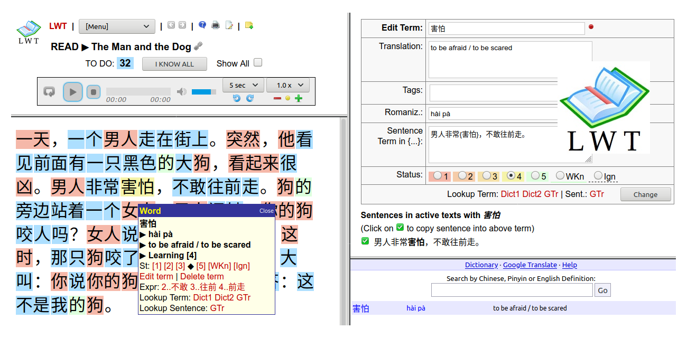
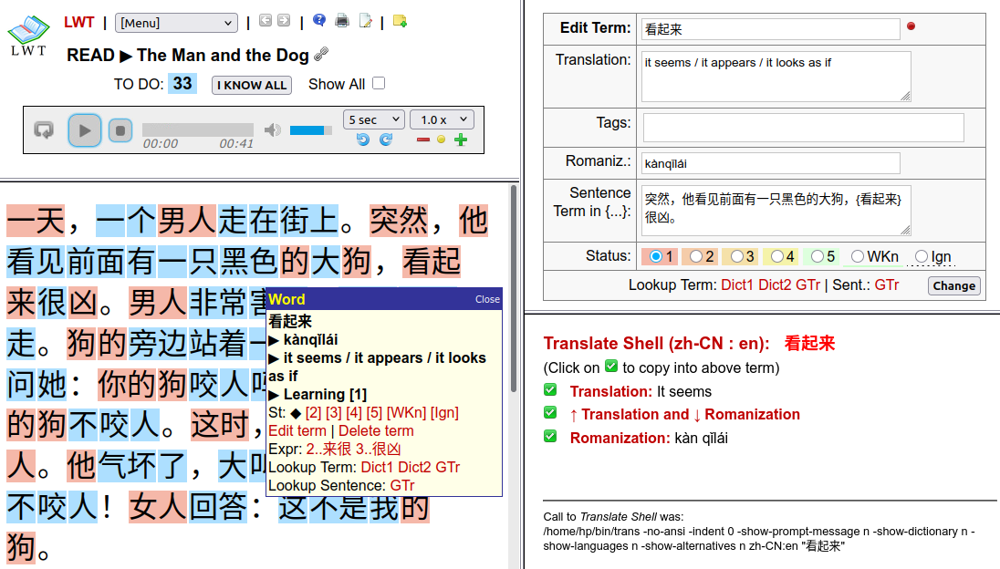

# Learning with Texts (LWT)

## This is the Official LWT Version 25.10.0 (October 25 2025)

**Please note:** All LWT forks on the web that I've found and tested are either outdated or buggy, even though they contain some new features or cleaner source code. 

This **official version** is from the original author, and it is **stable and bug-free**.

## Abstract

**LWT** is a tool for Language Learning, inspired by:

- [Stephen Krashen](https://en.wikipedia.org/wiki/Stephen_Krashen)'s [principles in Second Language Acquisition](https://www.sdkrashen.com/content/books/principles_and_practice.pdf),
- [Steve Kaufmann](https://en.wikipedia.org/wiki/Steve_Kaufmann)'s [LingQ](https://www.lingq.com) application, and
- ideas from [Khatzumoto](https://x.com/ajatt) - published at [AJATT - All Japanese All The Time](https://alljapanesealltheti.me/index.html).

To run LWT, you'll need:

- a modern web browser,
- a local web and database server with PHP - like [XAMPP](https://www.apachefriends.org/index.html), [MAMP](https://www.mamp.info/en/mac/), [LAMP](https://en.wikipedia.org/wiki/LAMP_(software_bundle)),
- and the LWT application, which can be downloaded here.

**NEW** in 25.10.0: Now with *Translate Shell* (only on macOS and Linux).

## PLEASE READ MORE:

- [LWT Documentation](https://hapepo23.github.io/lwt/info.htm)
- [LWT Installation](https://hapepo23.github.io/lwt/LWT_INSTALLATION.txt)
- [UNLICENSE.txt](UNLICENSE.txt)

## DOWNLOAD:

- [Latest releases](https://github.com/hapepo23/learning-with-texts/releases)

